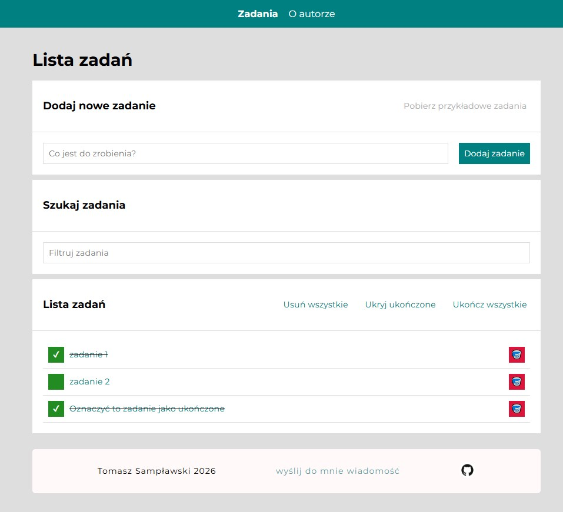

# To-do List in React

This is a simple task management application built with **React 19** and **Redux Toolkit**, featuring asynchronous data handling with **Redux-Saga**. The project demonstrates a modern approach to state management, side-effect handling, and persistent data storage. It allows users to add, remove, and toggle tasks, with persistent data storage and a fully responsive interface. This project is a comprehensive refactoring of an original Vanilla JavaScript application, via  a component-based React architecture, through a Custom Hook-based, into a centralized state management system using Redux.

You can try the application here: [Live Demo](https://samplawski.github.io/todo-list-react/)

## 1. Short Description

The Task List application focuses on clean code, modular architecture, and advanced state management. It demonstrates the power of Redux Toolkit for handling global state, Styled Components for dynamic styling, and Custom Selectors for optimized data access.

## 2. Features

- **Global State Management**: Powered by Redux Toolkit for predictable and centralized data flow.
- **Asynchronous Operations**: Uses **Redux-Saga** to handle side effects, such as fetching example tasks from a JSON file with a simulated loading state.
- **Data Persistence**: Automatic synchronization with Local Storage, optimized to trigger only on relevant state changes.
- **Declarative Navigation**: Separate views for Task List, Task Details (using URL parameters), and an Author page.
- **Dynamic ID Generation**: Uses `nanoid` to ensure unique identifiers for all tasks, even when fetched from external sources.
- **State Management**: Advanced task management (add, remove, toggle status, and bulk actions - complete all, remove all).
- **Filtering**: Search box allowing for filtering tasks by a given phrase.
- **Responsive Design**: Fully optimized for both desktop and mobile devices.
- **Theming**: Centralized theme management (colors, breakpoints, transitions) using Styled Components.
- **Interactive UI**: Smooth transitions, hover effects, and intuitive focus management.
- **Centralized Routing**: All application paths are managed in a single source of truth (routes.js).

## 3. Technologies Used

- **React 19** (Functional components, Hooks)
- **Redux Toolkit**:
  - 'createSlice' for logic encapsulation,
  - 'configureStore' for central store setup,
  - 'useSelector' & 'useDispatch' for component-store communication,
  - Custom Selectors for derived state logic.
- **Styled Components** (CSS-in-JS, ThemeProvider, GlobalStyles)
- **React Hooks**:
  - `useState` for local component state.
  - `useEffect` for Local Storage synchronization.
  - `useRef` for DOM manipulation (auto-focus).
  - `useQueryParameter` for efficient reading specific values from the URL search string.
  - `useReplaceQueryParameter` for provideing a clean interface for updating the URL without cluttering the component logic.
- **Redux-Saga**: Middleware for handling complex asynchronous side effects.
- **React Router** Dom v5 (Routing & URL Params) - "about the author" page accessible via navigation pane 
- **JavaScript ES6+**
- **HTML5 & CSS3** (via Styled Components and Normalize.css)

## 4. Installation and Running Locally

To run the application locally perform th ebelow instructions in the Bash terminal:

- Clone the repository:
      git clone [https://github.com/samplawski/todo-list-react.git](https://github.com/samplawski/todo-list-react.git)
- Navigate to the project directory using the command: cd todo-list-react
- install all dependencies (node.js packages): npm install
- Open the application in your web browser: npm start

The application will launch and open automatically in your browser at http://localhost:3000 (or a similar address).

## 5. How to Use

1. Visit the Task List application website.
2. Add tasks to the list using the input field and the "Dodaj zadanie" (Add Task) button.
3. Tasks will be displayed on the tasks list.
4. To mark a task as completed, click on the green checkbox next to the task.
5. To remove a task from the list, click on the red "Bin" button next to the task.
6. Use the control buttons above the list to manage task visibility or mark all tasks as finished instantly.
7. Available Scripts: 
  - npm start: Runs the app in development mode,
  - npm run build: Builds the app for production,
  - npm run deploy: Deploys the production build to GitHub Pages,
  - npm run repomix: Generates a packed representation of the codebase (using --style plain).

## 6. Status and Contributions

The project was created by Tomasz Sampławski and is still in build. This is a refactorisation of the original Vanilla JS application to the React environment. All interactions (adding, removing, filtering, and toggling completion status) are fully functional, including Local Storage support. Contributions are welcome and appreciated! You can use it in your own projects or customize it to your needs.

## 7. Contact

If you wish to contact me, you can email me at tsamplawski@gmail.com.
Project Link: https://github.com/samplawski/todo-list-react

## How to get started with Create React App

This project was bootstrapped with [Create React App](https://github.com/facebook/create-react-app).

### Available Scripts

In the project directory, you can run:

#### `npm start`

Runs the app in the development mode.\
Open [http://localhost:3000](http://localhost:3000) to view it in your browser.

The page will reload when you make changes.\
You may also see any lint errors in the console.

#### `npm run build`

Builds the app for production to the `build` folder.\
It correctly bundles React in production mode and optimizes the build for the best performance.

The build is minified and the filenames include the hashes.\
Your app is ready to be deployed!

See the section about [deployment](https://facebook.github.io/create-react-app/docs/deployment) for more information.

#### `npm run eject`

**Note: this is a one-way operation. Once you `eject`, you can't go back!**

If you aren't satisfied with the build tool and configuration choices, you can `eject` at any time. This command will remove the single build dependency from your project.

Instead, it will copy all the configuration files and the transitive dependencies (webpack, Babel, ESLint, etc) right into your project so you have full control over them. All of the commands except `eject` will still work, but they will point to the copied scripts so you can tweak them. At this point you're on your own.

You don't have to ever use `eject`. The curated feature set is suitable for small and middle deployments, and you shouldn't feel obligated to use this feature. However we understand that this tool wouldn't be useful if you couldn't customize it when you are ready for it.